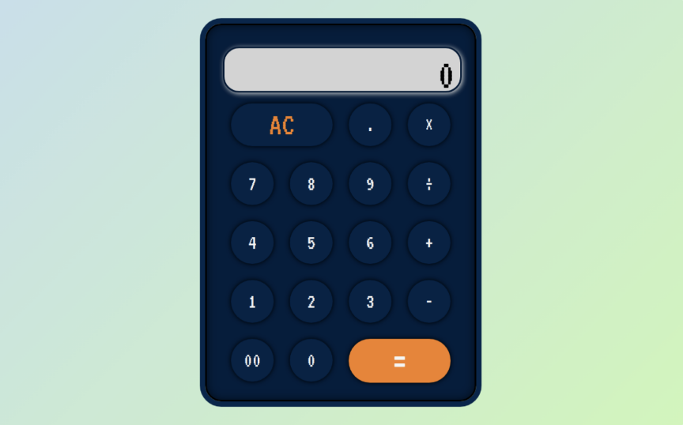

<h1 align="center">
<br>
Calculator
<br>
</h1>
<h4 align="center">A minimalistic JavaScript Calculator</h4>



## Run the App

**Install all the dependencies:** 
<br>
*npm*
```sh
npm install 
```
*yarn*
```sh
yarn install
```
*pnpm*
```sh
pnpm install
```
<br>
<br>

**Change the directory by running the command**:
```sh
cd calculator-logic
```
<br>
<br>

**In the calculator-logic directory, you can run**: 
```sh
open index.html
```
<br>
<br>

**If you want to run tests:** <br>
*npm*
```sh
npm test 
```
*yarn*
```sh
yarn test
```

## Information about the project

Calculator app is a simple calculator for general purposes. You can use it to multiply, divide, add and subtract numbers. 

### Features:
* multiplication
* division
* addition
* substraction
* all clear (AC)

## This project was built with:
* JavaScript
* HTML
* CSS
* <a href="https://jestjs.io/">Jest testing library</a>
